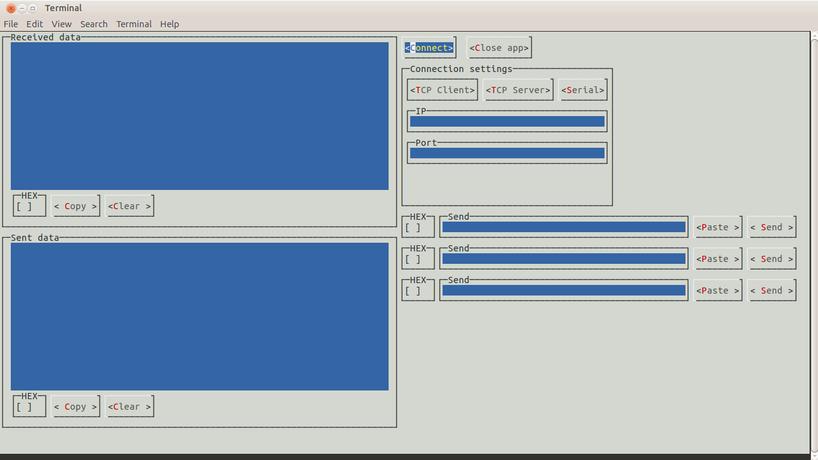

# DoomsdayTerminal
 Graphical CLI app for testing TCP and serial communication. Still in early stages, but works with some quirks.
 App uses the awesome [**Lanterna**](https://github.com/mabe02/lanterna) library as the GUI toolkit.

## Features
* 3 types of connections: TCP client, TCP server and serial,
* display received and sent data either in textual or in hex representation,
* send data either in textual or in hex representation,
* send the contents of a chosen file,
* where possible, clipboard support.

## Features yet to be implemented
* charset chooser on received/sent data, and data to send,
* log received and sent data to a chosen file,
* join two connections so they exchange data through the app,
* use the Java 9 modularization to build a minimal, zero dependency native app for all platforms.
